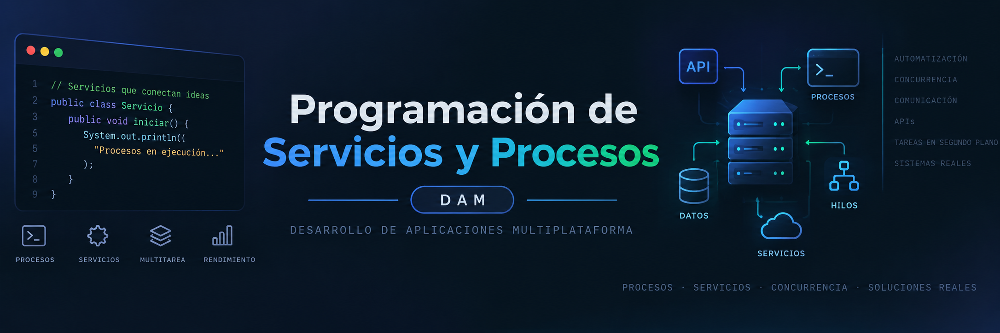

## Contexto
Programación de Servicios y Procesos(en adelante PSP) forma parte del segundo curso del Ciclo Formativo de Grado Superior Desarrollo de Aplicaciones Multiplataforma (en adelante DAM), de la familia de Informática. Este ciclo se distribuye en dos cursos con un total de 2.000 horas, de las cuales 60 horas corresponden a nuestro módulo, que se imparte en el segundo curso a razón de 3 horas semanales. 

## Contenidos
1. Programación Multiproceso
2. Aplicaciones multihilo
3. Comunicaciones en Red
5. Desarrollo de Servicios en Red
6. Seguridad de la información

El índice y contenidos puede variar a lo largo del curso para adaptarse al proceso de enseñanza-aprendizaje.

## Autor

Codificado con :sparkling_heart: por [Paco Gómez Arnal](https://www.linkedin.com/in/paco-gomez-arnal/)

## Licencia de uso

Este repositorio y todo su contenido está licenciado bajo licencia **Creative Commons**, . Por favor si compartes, usas o modificas este proyecto cita a su autor, y usa las mismas condiciones para su uso docente, formativo o educativo y no comercial.

 JoseLuisGS by <a xmlns:cc="http://creativecommons.org/ns#" href="https://joseluisgs.github.io/" property="cc:attributionName" rel="cc:attributionURL">José Luis González Sánchez</a> is licensed under a <a rel="license" href="http://creativecommons.org/licenses/by-nc-sa/4.0/">Creative Commons Reconocimiento-NoComercial-CompartirIgual 4.0 Internacional License</a>. Creado a partir de la obra en <a xmlns:dct="http://purl.org/dc/terms/" href="https://github.com/joseluisgs" rel="dct:source">https://github.com/joseluisgs</a>.